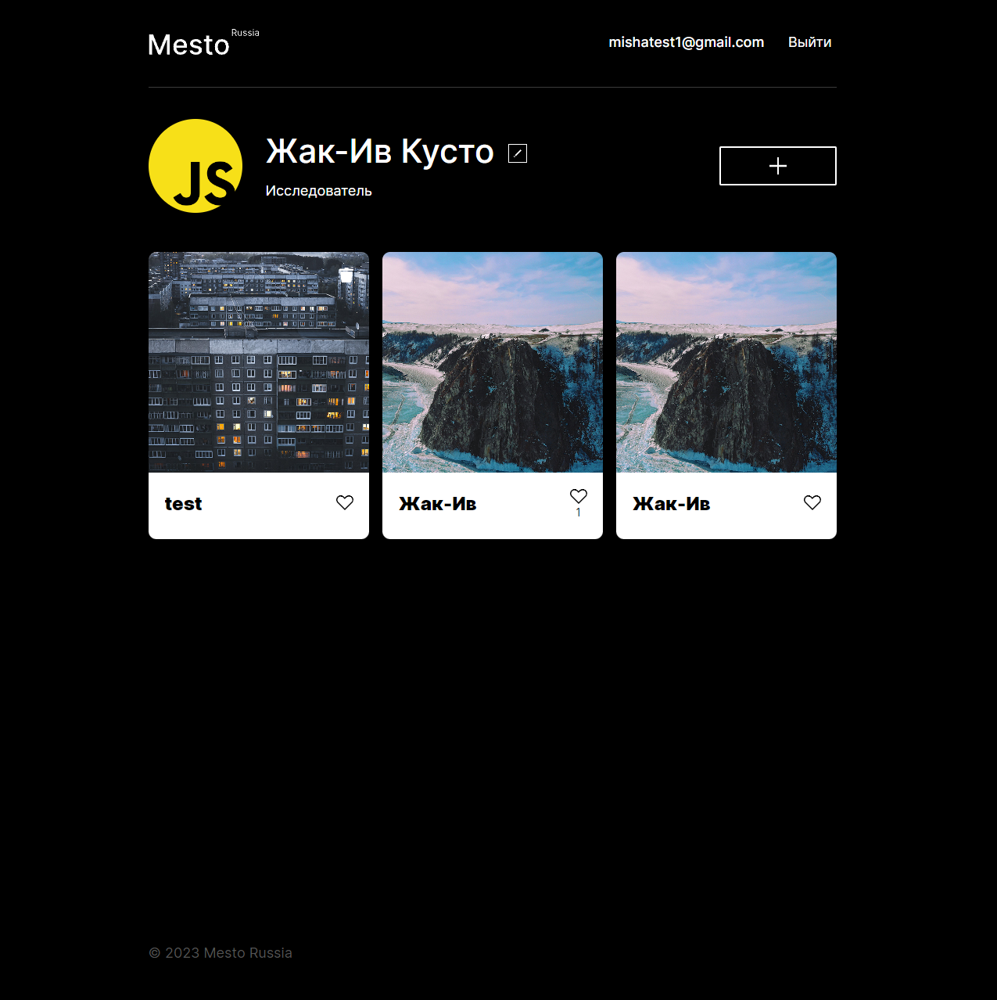

# react-mesto-api-full
Репозиторий для приложения проекта `Mesto`, включающий фронтенд и бэкенд части приложения со следующими возможностями: авторизации и регистрации пользователей, операции с карточками и пользователями.

[Адрес репозитория](https://github.com/MikhailDushechkin/react-mesto-api-full-gha)

> бэкенд в директории `backend/`  
> фронтенд в директории `frontend/`

## Применены технологии

* Flexbox;
* Grid Layout;
* Позиционирование;
* BEM методология;
* Nested BEM;
* Псевдоклассы;
* JavaScript
* React
## Функционал

* Адаптивный дизайн;
* Hover и focus эффект для кнопок;
* Построение сетки с изображениями при помощи grid;
* Валидация форм;
* Возможность редактировать профиль пользователя;
* Возможность добавлять новые фотокарточки;
* Возможность поставить/снять "лайк" на фото;
* Возможность удаления своих фотокарточек;
* Закрытие поп-ап через кнопку, оверлей и кнопку Esc;
* Счетчик лайков;
* Редактирование аватара профиля
## Ссылки на проект

IP 158.160.26.115

Frontend https://dmm.front.mesto.nomoredomains.monster/

Backend https://dmm.back.mesto.nomoredomains.monster

